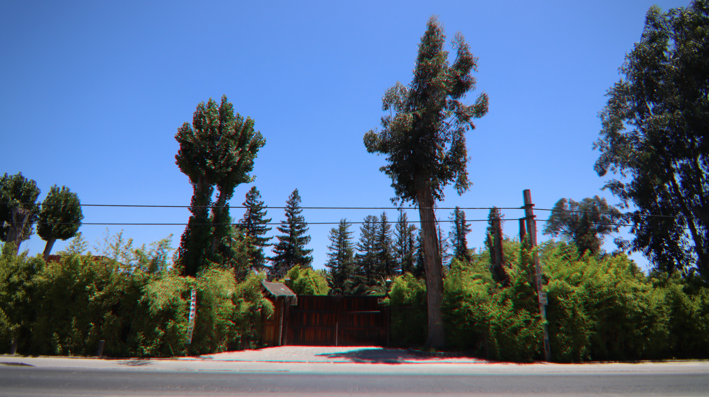

# SEO Action Plan — Las Secoyas
**URL:** https://inmejorableinversiongastronomica.com/  
**Generated:** 2026-05-19  
**Overall Score:** 41/100  

---

## CRITICAL — Fix Immediately (Blocks indexing or causes significant ranking penalties)

### 1. Add canonical tag to `<head>`
**File:** `index.html` — inside `<head>`, after `<meta name="robots">`  
**Effort:** 2 min

```html
<link rel="canonical" href="https://inmejorableinversiongastronomica.com/">
```

---

### 2. Fix render-blocking Google Translate script
**File:** `index.html` line 55  
**Effort:** 2 min  
**Impact:** Removes ~300–600ms from LCP

Change from:
```html
<script type="text/javascript" src="https://translate.google.com/translate_a/element.js?cb=googleTranslateElementInit"></script>
```
To:
```html
<script defer src="https://translate.google.com/translate_a/element.js?cb=googleTranslateElementInit"></script>
```

---

### 3. Fix `og:image` broken relative path
**File:** `index.html` line 28  
**Effort:** 2 min  
**Impact:** Fixes social sharing previews on WhatsApp, LinkedIn, Facebook

Change:
```html
<meta property="og:image" content="images/secoyas11.jpeg">
```
To:
```html
<meta property="og:image" content="https://inmejorableinversiongastronomica.com/images/secoyas11.jpeg">
<meta property="og:image:width" content="1200">
<meta property="og:image:height" content="630">
```

---

### 4. Deploy sitemap.xml and robots.txt
**Files:** Already generated at project root ✅  
**Effort:** Deploy to web root, then submit sitemap in Google Search Console  
**Action after deploy:** Go to [search.google.com/search-console](https://search.google.com/search-console) → Sitemaps → Add: `https://inmejorableinversiongastronomica.com/sitemap.xml`

---

### 5. Add schema markup (5 JSON-LD blocks)
**File:** `index.html` — paste all blocks just before `</head>`  
**Effort:** 20 min  
**Impact:** Enables star ratings in SERPs, AI citation eligibility, Knowledge Panel signals

**Block 1 — Organization + AggregateRating (paste as-is):**
```html
<script type="application/ld+json">
{
  "@context": "https://schema.org",
  "@type": "Organization",
  "@id": "https://inmejorableinversiongastronomica.com/#organization",
  "name": "Las Secoyas SPA",
  "alternateName": "Parque Las Secoyas",
  "url": "https://inmejorableinversiongastronomica.com/",
  "logo": "https://inmejorableinversiongastronomica.com/images/logo2.png",
  "image": "https://inmejorableinversiongastronomica.com/images/secoyas11.jpeg",
  "description": "Centro de eventos y restaurante de servicio completo especializado en matrimonios y celebraciones, con 16 años de operación en Calera de Tango, Chile. Capacidad para 300 personas en 7.300 m² de parque.",
  "foundingDate": "2008",
  "address": {
    "@type": "PostalAddress",
    "streetAddress": "Camino Lonquén Norte 12180, Paradero 8",
    "addressLocality": "Calera de Tango",
    "addressRegion": "Región Metropolitana",
    "addressCountry": "CL"
  },
  "geo": {
    "@type": "GeoCoordinates",
    "latitude": -33.594711881692504,
    "longitude": -70.78373717081764
  },
  "telephone": ["+56968345841", "+56998294673"],
  "email": "infosecoyaseventos@gmail.com",
  "aggregateRating": {
    "@type": "AggregateRating",
    "ratingValue": "4.9",
    "bestRating": "5",
    "worstRating": "1",
    "reviewCount": "13"
  },
  "award": ["10× Wedding Awards 2014–2024 — Matrimonios.cl"],
  "sameAs": [
    "https://www.matrimonios.cl/centros-de-eventos/las-secoyas--e70516/opiniones"
  ]
}
</script>
```

**Block 2 — WebSite + WebPage (paste as-is):**
```html
<script type="application/ld+json">
{
  "@context": "https://schema.org",
  "@graph": [
    {
      "@type": "WebSite",
      "@id": "https://inmejorableinversiongastronomica.com/#website",
      "url": "https://inmejorableinversiongastronomica.com/",
      "name": "Las Secoyas — Una Inmejorable Inversión Gastronómica",
      "inLanguage": "es-CL",
      "publisher": { "@id": "https://inmejorableinversiongastronomica.com/#organization" }
    },
    {
      "@type": "WebPage",
      "@id": "https://inmejorableinversiongastronomica.com/#webpage",
      "url": "https://inmejorableinversiongastronomica.com/",
      "name": "Las Secoyas — Una Inmejorable Inversión Gastronómica",
      "description": "Gran oportunidad de inversión. Negocio de eventos de servicio completo en Chile. 16 años de operación. UF 50.000 llave en mano. ROI 22,2%.",
      "inLanguage": "es-CL",
      "isPartOf": { "@id": "https://inmejorableinversiongastronomica.com/#website" },
      "about": { "@id": "https://inmejorableinversiongastronomica.com/#organization" },
      "dateModified": "2026-05-19"
    }
  ]
}
</script>
```

**Block 3 — VideoObject (⚠️ fill in `uploadDate` and `duration` from YouTube before deploying):**
```html
<script type="application/ld+json">
{
  "@context": "https://schema.org",
  "@type": "VideoObject",
  "name": "Las Secoyas — Vídeo de la Propiedad",
  "description": "Recorrido en vídeo por las instalaciones del centro de eventos y parque Las Secoyas en Calera de Tango, Chile.",
  "thumbnailUrl": "https://img.youtube.com/vi/olBBo8gIjfU/maxresdefault.jpg",
  "uploadDate": "REPLACE_WITH_DATE_FROM_YOUTUBE",
  "duration": "REPLACE_WITH_DURATION_e.g._PT3M22S",
  "contentUrl": "https://www.youtube.com/watch?v=olBBo8gIjfU",
  "embedUrl": "https://www.youtube.com/embed/olBBo8gIjfU",
  "publisher": { "@id": "https://inmejorableinversiongastronomica.com/#organization" }
}
</script>
```

**Block 4 — Offer / business for sale (paste as-is):**
```html
<script type="application/ld+json">
{
  "@context": "https://schema.org",
  "@type": "Offer",
  "name": "Venta Llave en Mano — Las Secoyas SPA",
  "description": "Venta de negocio en funcionamiento: centro de eventos Las Secoyas SPA. Incluye propiedad, marca, equipamiento, mobiliario y permisos. Sin deudas.",
  "url": "https://inmejorableinversiongastronomica.com/",
  "price": "50000",
  "priceCurrency": "CLF",
  "itemOffered": { "@id": "https://inmejorableinversiongastronomica.com/#organization" },
  "availability": "https://schema.org/InStock"
}
</script>
```

**Block 5 — FAQPage (add FAQ section to HTML first — see item #10 below, then use this):**
```html
<script type="application/ld+json">
{
  "@context": "https://schema.org",
  "@type": "FAQPage",
  "mainEntity": [
    {
      "@type": "Question",
      "name": "¿Cuál es el precio de venta de Las Secoyas SPA?",
      "acceptedAnswer": {
        "@type": "Answer",
        "text": "El precio de venta es UF 50.000 llave en mano. El valor tasado es UF 79.000, lo que representa un descuento del 37%."
      }
    },
    {
      "@type": "Question",
      "name": "¿Cuál es el ROI anual de la inversión?",
      "acceptedAnswer": {
        "@type": "Answer",
        "text": "El ROI anual proyectado es del 22,2%, con ventas brutas de UF 20.061 y una utilidad bruta de UF 8.248 (margen 41%). La inversión se recupera en aproximadamente 6 años."
      }
    },
    {
      "@type": "Question",
      "name": "¿El local sigue operando durante el proceso de venta?",
      "acceptedAnswer": {
        "@type": "Answer",
        "text": "Sí. Las Secoyas SPA continúa operando y recibiendo eventos y matrimonios mientras busca un nuevo socio comercial o comprador."
      }
    },
    {
      "@type": "Question",
      "name": "¿Dónde está ubicado el centro de eventos Las Secoyas?",
      "acceptedAnswer": {
        "@type": "Answer",
        "text": "Las Secoyas está ubicado en Camino Lonquén Norte 12180, Calera de Tango, Región Metropolitana, Chile. La propiedad tiene 7.300 m² de terreno y 1.050 m² construidos."
      }
    },
    {
      "@type": "Question",
      "name": "¿Se puede comprar el 50% del negocio?",
      "acceptedAnswer": {
        "@type": "Answer",
        "text": "Sí. Existe la opción de comprar el 50% de la propiedad y el negocio. También se ofrece financiamiento directo en UF con 0% de interés y 6 meses de gracia."
      }
    }
  ]
}
</script>
```

---

## HIGH — Fix Within 1 Week

### 6. Hardcode financial metrics into visible HTML
**File:** `index.html` — metric card `<span>` elements  
**Effort:** 15 min  
**Impact:** Makes all financial data readable by crawlers and AI systems

For each animated counter, add the real value as initial text content:
```html
<!-- Find each span like this: -->
<span class="metric-value">0</span>

<!-- Change to (example for 20.061 UF): -->
<span class="metric-value" aria-label="20.061">20.061</span>
```
JS will still animate from 0 to the target on scroll. Crawlers see the real value. Apply to all 5 metric cards.

---

### 7. Add `width`/`height` to all images + lazy loading
**File:** `index.html`  
**Effort:** 20 min  
**Impact:** Eliminates ~60–80% of CLS

Add dimensions to hero image (fix CLS, improves LCP):
```html

```

Add `loading="lazy"` + dimensions to all carousel images:
```html

```

Add `loading="lazy"` to both iframes:
```html
<iframe src="https://www.youtube.com/embed/..." loading="lazy" width="560" height="315" ...>
<iframe src="https://www.google.com/maps/embed?..." loading="lazy" width="100%" height="300" ...>
```

---

### 8. Load Google Fonts asynchronously
**File:** `index.html` — replace the two `<link>` tags for Google Fonts in `<head>`  
**Effort:** 10 min  
**Impact:** Removes render-blocking, fixes font-swap CLS

```html
<!-- Keep preconnects -->
<link rel="preconnect" href="https://fonts.googleapis.com">
<link rel="preconnect" href="https://fonts.gstatic.com" crossorigin>

<!-- Replace the synchronous font link with: -->
<link rel="preload" as="style"
  href="https://fonts.googleapis.com/css2?family=Montserrat:wght@400;600;700;900&family=Raleway:ital,wght@0,400;0,600;0,700;1,400&display=swap"
  onload="this.onload=null;this.rel='stylesheet'">
<noscript>
  <link rel="stylesheet" href="https://fonts.googleapis.com/css2?family=Montserrat:wght@400;600;700;900&family=Raleway:ital,wght@0,400;0,600;0,700;1,400&display=swap">
</noscript>
```

---

### 9. Add disambiguation banner for venue seekers
**File:** `index.html` — add just below the hero section (before `.trust-bar`)  
**Effort:** 5 min  
**Impact:** Retains accidental venue-seeker visits as warm leads

```html
<div class="venue-status-banner">
  Las Secoyas continúa operando y recibiendo matrimonios y eventos mientras busca un nuevo socio comercial.
  <a href="https://api.whatsapp.com/send?phone=56968345841&text=Hola,%20quisiera%20consultar%20sobre%20disponibilidad%20para%20un%20evento"
     target="_blank" rel="noopener noreferrer">Consultar disponibilidad</a>
</div>
```

---

### 10. Rewrite H1 and meta description
**File:** `index.html`  
**Effort:** 5 min

**H1** (line ~109) — change from:
```html
<h1 class="hero-title" data-aos="fade-up">Las Secoyas</h1>
```
To:
```html
<h1 class="hero-title" data-aos="fade-up">Centro de Eventos en Venta — Las Secoyas, Calera de Tango</h1>
```

**Meta description** (line ~22) — change to (153 chars):
```html
<meta name="description" content="Inversión gastronómica llave en mano en Chile. Centro de eventos con 16 años de operación, ROI 22,2%, capacidad 300 personas. UF 50.000 — Calera de Tango.">
```

---

### 11. Add missing Open Graph tags
**File:** `index.html` — add after existing OG tags  
**Effort:** 3 min

```html
<meta property="og:type" content="website">
<meta property="og:locale" content="es_CL">
<meta property="og:site_name" content="Las Secoyas">
<meta name="twitter:card" content="summary_large_image">
<meta name="twitter:title" content="Las Secoyas - Una Inmejorable Inversión Gastronómica">
<meta name="twitter:description" content="Inversión gastronómica llave en mano en Chile. Centro de eventos con 16 años de operación. UF 50.000 — Calera de Tango.">
<meta name="twitter:image" content="https://inmejorableinversiongastronomica.com/images/secoyas11.jpeg">
```

---

### 12. Fix Meta Pixel — move to bottom of `<body>`
**File:** `index.html`  
**Effort:** 5 min  
**Impact:** Removes one inline blocking script from `<head>`

Move the entire `<!-- Meta Pixel -->` block (lines ~41–52) to just before `</body>`.

---

### 13. Fix `submit-form.php` — From domain mismatch
**File:** `submit-form.php` line 35  
**Effort:** 2 min  
**Impact:** Stops form emails going to spam

Change:
```php
$headers = "From: info@inmejorableinversiongastronomica.com\r\n";
```
To:
```php
$headers = "From: info@inmejorableinversiongastronomica.com\r\n";
```
Then verify the `.cl` domain has an SPF record in DNS.

---

### 14. Add credibility block to metrics section
**File:** `index.html` — after `<p class="metrics-note">` (the asterisk note, ~line 194)  
**Effort:** 10 min  
**Impact:** Converts unverified projections into substantiated claims for sophisticated buyers

Add a sourcing disclosure (fill in the blanks):
```html
<div class="metrics-source">
  <p>Valuación de propiedad realizada por <strong>[Nombre Tasadora], [Año]</strong>.
  Proyecciones basadas en estados financieros del período <strong>[año inicio]–[año fin]</strong>.
  Documentación completa disponible bajo carta de confidencialidad.</p>
</div>
```

---

## MEDIUM — Fix Within 1 Month

### 15. Add a seller bio / "Quiénes Somos" section
Introduce the owner by full name, role, and years of involvement. 150–200 words + photo. This is the single largest trust gap for a USD 2M transaction.

### 16. Add an FAQ section (6–8 questions)
Investor-intent questions: "¿Qué incluye la venta?", "¿Por qué el descuento respecto a la tasación?", "¿Cuál es la estructura societaria?", "¿Hay personal contratado?", "¿Cuál es la temporada de mayor demanda?". Each answer 2–4 sentences. Then activate Block 5 schema above.

### 17. Gate the PDF download with a lead form
Replace the direct `<a href="PPT_SECOYAS.pdf" download>` link with a modal that captures name + email + phone before triggering the download. Every anonymous download is currently an unidentified lead.

### 18. Create `/llms.txt`
**File:** Create `llms.txt` at web root  
Provides AI systems with JS-free access to all key financial data, bypassing the counter rendering problem entirely. Include all metrics, address, ratings, awards, and contact information in plain text.

### 19. Create `.htaccess` for HTTPS enforcement and security headers
```apache
RewriteEngine On
RewriteCond %{HTTPS} off [OR]
RewriteCond %{HTTP_HOST} ^www\. [NC]
RewriteRule ^ https://inmejorableinversiongastronomica.com%{REQUEST_URI} [R=301,L,NE]

Header always set Strict-Transport-Security "max-age=31536000; includeSubDomains"
Header always set X-Content-Type-Options "nosniff"
Header always set X-Frame-Options "SAMEORIGIN"
Header always set Referrer-Policy "strict-origin-when-cross-origin"
```

### 20. Standardize business name across all touchpoints
Decide on one canonical name (recommend: "Parque Las Secoyas" to match GBP). Update: page title, og:title, footer copyright, schema `name`, GBP listing. Currently three variants exist.

### 21. Fix NAP: add "Paradero 8" to footer address
`index.html` line ~810 — footer omits "Paradero 8" from address. Must match GBP listing exactly.

### 22. Verify and optimize Google Business Profile
- Primary category: confirm "Salón de eventos" / "Centro de eventos"
- Add 750-char keyword-rich description mentioning "matrimonios", "Calera de Tango", "inversión"
- Update website field to point to this URL
- Seed Q&A section with investor and venue-seeker questions
- Link all social profiles (Facebook page URL from Pixel 1425920294918620)

### 23. Add `rel="noopener noreferrer"` to all `target="_blank"` links
WhatsApp button (line 61), WhatsApp CTA (line 730), Matrimonios.cl link (line 710).

### 24. Convert images to WebP format
Use a tool like Squoosh, Sharp, or cwebp to generate `.webp` versions of all JPEG/PNG images. Wrap in `<picture>` elements. Expected 25–35% file size reduction → faster LCP.

---

## LOW — Backlog

### 25. Add `<meta name="theme-color" content="#2d6a4f">`
One line, improves mobile browser chrome color.

### 26. Reorder scripts — move `main.js` to last
`main.js` currently loads before Swiper, AOS, jQuery, and Bootstrap.

### 27. Register IndexNow with Bing
Generate key at bing.com/indexnow, place key file at web root, ping URL on each deploy.

### 28. Add citation listings on Chilean directories
Priority: TripAdvisor (restaurant component), Casamientos.cl, Portalinmobiliario.cl (investment angle), Facebook Business Page (link from site footer).

### 29. Create a YouTube channel with venue tour
YouTube presence has 0.737 correlation with AI citation — the strongest measured signal. Upload a 3–5 minute venue walkthrough with Spanish narration, on-screen metrics text, and description containing full address + financial highlights.

### 30. Add privacy policy page
Required for data collection compliance. Link from the contact form.

---

## Projected Score After Critical + High Fixes

| Category | Current | After Fixes |
|---|---|---|
| Technical SEO | 46 | 72 |
| Content Quality | 61 | 74 |
| On-Page SEO | 41 | 62 |
| Schema | 0 | 75 |
| Performance | 35 | 68 |
| AI Search Readiness | 34 | 61 |
| Images | 25 | 50 |
| **Overall** | **41** | **~67** |
