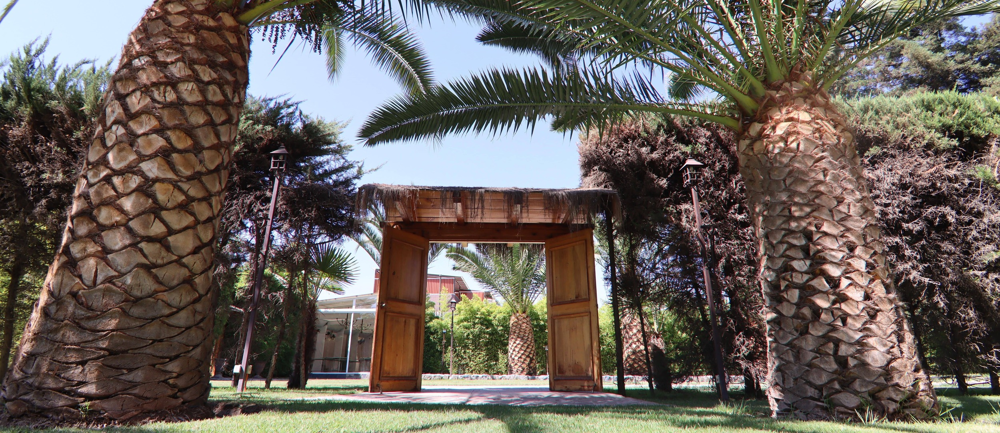

# SEO Full Audit Report — Las Secoyas
**URL:** https://inmejorableinversiongastronomica.com/  
**Audit Date:** 2026-05-19  
**Business:** Las Secoyas SPA — Centro de Eventos y Matrimonios, Calera de Tango, Chile  
**Business Type:** Investment pitch (business for sale) + operating wedding/events venue  

---

## Overall SEO Health Score: 41 / 100

| Category | Weight | Score | Weighted |
|---|---|---|---|
| Technical SEO | 22% | 46 | 10.1 |
| Content Quality | 23% | 61 | 14.0 |
| On-Page SEO | 20% | 41 | 8.2 |
| Schema / Structured Data | 10% | 0 | 0.0 |
| Performance (CWV) | 10% | 35 | 3.5 |
| AI Search Readiness | 10% | 34 | 3.4 |
| Images | 5% | 25 | 1.3 |
| **TOTAL** | **100%** | | **40.5** |

---

## Executive Summary

Las Secoyas has a well-designed, visually polished single-page site with genuine trust signals — 16 years of operation, real third-party reviews (4.9 Matrimonios.cl, 4.3 Google), 10 Wedding Awards, and verified financial metrics. These are strong raw assets that the site is currently failing to transmit to search engines or AI systems.

The core problem is architectural: the site was built for human conversion (and does that reasonably well) but has almost no SEO infrastructure at all. Zero structured data, no canonical tag, no security headers, render-blocking third-party scripts, JavaScript-gated financial content, and no optimization for the specific investment-pitch search intent it targets.

The good news: virtually all of the critical and high-priority fixes are low-effort HTML edits or new files that can be deployed in a day without changing any visible design.

**Top 5 Critical Issues**
1. Zero schema markup — no rich results, no star ratings in SERPs, no AI citation eligibility
2. Financial metrics rendered via JavaScript counters — invisible to all crawlers and AI systems
3. Google Translate script render-blocking in `<head>` — direct LCP failure
4. No canonical tag — duplicate content signal risk
5. Hero image has no preload, no dimensions, no `fetchpriority` — CLS and LCP failure

**Top 5 Quick Wins (under 30 min each)**
1. Add `<link rel="canonical">` to `<head>`
2. Add `fetchpriority="high"` + `<link rel="preload">` + `width`/`height` to hero image
3. Fix `og:image` to absolute URL
4. Add `defer` to Google Translate script
5. Add `loading="lazy"` to all off-screen images and iframes

---

## 1. Technical SEO — Score: 46/100

### Critical

**C-1. No canonical tag**  
`og:url` is not a canonical signal — it is a social hint. Add to `<head>` (index.html line ~20):
```html
<link rel="canonical" href="https://inmejorableinversiongastronomica.com/">
```

**C-2. Google Translate script is render-blocking**  
`index.html` line 55 loads `translate.google.com/translate_a/element.js` synchronously in `<head>` with no `async`/`defer`. This blocks HTML parsing on every page load until the external script downloads and executes — a direct LCP killer.
```html
<!-- Change to: -->
<script defer src="https://translate.google.com/translate_a/element.js?cb=googleTranslateElementInit"></script>
```

**C-3. `og:image` uses a relative path — broken for all social previews**  
`<meta property="og:image" content="images/secoyas11.jpeg">` — social crawlers require absolute URLs. Change to:
```html
<meta property="og:image" content="https://inmejorableinversiongastronomica.com/images/secoyas11.jpeg">
<meta property="og:image:width" content="1200">
<meta property="og:image:height" content="630">
```

**C-4. No robots.txt** ✅ *Created*  
`robots.txt` has been generated at the project root. Deploy to web root.

**C-5. No sitemap.xml** ✅ *Created*  
`sitemap.xml` has been generated at the project root. Deploy to web root, then submit in Google Search Console.

### High

**H-1. Hero LCP image not preloaded or prioritised**  
`images/secoyas11.jpeg` is the LCP element. Add to `<head>` immediately after viewport meta:
```html
<link rel="preload" as="image" href="images/secoyas11.jpeg" fetchpriority="high">
```
Update the `` tag:
```html

```

**H-2. All carousel and off-screen images lack lazy loading**  
11 carousel images load eagerly at page start. Add `loading="lazy"` to every image not in the initial viewport.

**H-3. YouTube and Maps iframes have no lazy loading**  
Both iframes trigger multiple third-party connections on load. Add `loading="lazy"` to both. Also add explicit `width`/`height` or an aspect-ratio CSS wrapper to prevent layout shifts.

**H-4. No structured data (JSON-LD)** — see Section 5.

**H-5. No `.htaccess` — no HTTPS enforcement or security headers**  
Without an `.htaccess`, there is no guaranteed redirect from HTTP to HTTPS or from www to non-www. No security headers (`Strict-Transport-Security`, `X-Content-Type-Options`, etc.) are served.

### Medium

**M-1. Incomplete Open Graph tags**  
Missing: `og:type`, `og:locale`, `og:site_name`. Add:
```html
<meta property="og:type" content="website">
<meta property="og:locale" content="es_CL">
<meta property="og:site_name" content="Las Secoyas">
```

**M-2. No Twitter/X Card tags**

**M-3. All images served as JPEG — no WebP/AVIF**  
Modern formats are 25–50% smaller. Use `<picture>` with WebP sources.

**M-4. No `width`/`height` on any `` element**  
Every image causes a layout reflow when it loads. CLS source. Add intrinsic dimensions to all `` tags.

**M-5. `main.js` loaded before its dependencies**  
`scripts/main.js` is at line 836, before Swiper, AOS, jQuery, and Bootstrap. Move it to last.

**M-6. Contact form: no CSRF, uses PHP `mail()`, mismatched `From:` domain**  
`submit-form.php` sends from `info@inmejorableinversiongastronomica.com` (`.com`) but the site is `.cl`. The `.com` domain likely has no SPF record — emails will go to spam. Fix the From address to `@inmejorableinversiongastronomica.com` and add a CAPTCHA.

### Low

**L-1. `meta keywords` tag is dead weight** — Google has ignored this since 2009. Remove or leave as-is.  
**L-2. No IndexNow protocol integration** — submit key to bing.com/indexnow.  
**L-3. No `rel="noopener noreferrer"` on `target="_blank"` links** — WhatsApp, Matrimonios.cl.

---

## 2. Content Quality — Score: 61/100

### E-E-A-T Breakdown

| Dimension | Score | Notes |
|---|---|---|
| Experience | 14/20 | 16-year history + real reviews. Owner not formally introduced. |
| Expertise | 15/25 | UF/financial vocabulary is correct. ROI claim unsubstantiated. |
| Authoritativeness | 14/25 | Matrimonios.cl authority is strong. No media coverage or broker. |
| Trustworthiness | 18/30 | Footer disclaimer is appropriate. No RUT, no privacy policy. |

### Critical

**E-1. No seller/operator bio**  
"Francisco" is mentioned only in testimonials. A USD 2M investment decision requires knowing who is selling. Add a 150–200 word "Quiénes Somos" section with full name, role, and photo.

**E-2. ROI claim (22.2%) is unsupported**  
The most important number on the page is labelled as a projection with no methodology. Either add a brief methodology note or offer a downloadable executive summary PDF with the full calculation. This is the #1 objection from sophisticated buyers.

### High

**E-3. No RUT (Chilean tax ID) for Las Secoyas SPA**  
Every Chilean company has a publicly verifiable tax ID in the SII registry. Its absence prevents a buyer from self-serving due diligence before contact.

**E-4. Appraisal source unnamed**  
"Tasación UF 79,000" with no named appraiser or date is an unverified price anchor. Add one line: "Tasación realizada por [Firma], [Año]."

**E-5. Meta description is 285 characters — truncates in SERPs**  
Recommended max: 155 characters. Rewrite:
> "Inversión gastronómica llave en mano en Chile. Centro de eventos con 16 años de operación, ROI 22,2%, capacidad 300 personas. UF 50.000 — Calera de Tango." (153 chars)

### Medium

**E-6. Missing "Reason for sale" section** — the most common first question from buyers. Its absence creates negative inference.

**E-7. Missing "What is included in the sale" structured list** — property, brand, licenses, staff contracts, supplier relationships.

**E-8. No FAQ section** — investors have predictable questions. A 6–8 question FAQ directly serves intent and is the top AI Overview extraction format.

**E-9. "x10 Wedding Awards" lacks attribution** — no awarding body named, no year range (2014–2024 only in the HTML text). Link to the Matrimonios.cl award page.

### Low

**E-10. No privacy policy** — required for data collection compliance; signals institutional-quality management to international investors.

---

## 3. On-Page SEO — Score: 41/100

**Critical issues:**

- **H1 is "Las Secoyas"** — brand name only, zero keyword value. The logo already carries the brand. The H1 should be: `Centro de Eventos en Venta — Las Secoyas, Calera de Tango` or `Inversión Gastronómica Llave en Mano — Centro de Eventos Las Secoyas`
- **Hero subtitle in a `<p>` tag** — "Una Inmejorable Inversión Gastronómica" is keyword-rich but in body text, not a heading. Promote to `<h2>`.
- **Page-type mismatch** — the page fights three incompatible intent clusters: investor acquisition, venue discovery, and broad real estate search. Investors convert, but venue seekers bounce without explanation. Add a single disambiguation sentence: *"Las Secoyas continúa recibiendo eventos mientras busca un nuevo socio comercial."*

**NAP inconsistencies (critical for local SEO):**

| Field | Contact Section | Footer | Discrepancy |
|---|---|---|---|
| Name | "Las Secoyas" (implied) | "Las Secoyas SPA" | Plus "Parque Las Secoyas" on GBP — 3 variants |
| Address | Camino Lonquén Norte 12180, Paradero 8 | Camino Lonquén Norte 12180 | Footer omits "Paradero 8" |
| Phone 2 | Present | Absent | Footer missing second number |

Standardize name to match GBP ("Parque Las Secoyas") across all instances.

---

## 4. Local SEO — Score: 28/100

**Critical structural problem:** The domain `inmejorableinversiongastronomica.com` and every on-page SEO element are optimized for an investor, not for venue discovery. Google indexes this page as an investment/real estate opportunity. Local pack ranking for "centro de eventos Calera de Tango" or "salón de bodas Santiago" is essentially impossible from this URL without a structural pivot or a separate venue domain.

**Two paths forward:**

- **Path A (recommended long-term):** Create `parlassecoyas.cl` or `lassecoyas.cl` as the canonical venue website. Point GBP to it. Keep the investment pitch on the current domain. Link between both.
- **Path B (immediate):** Add venue-discovery sections with proper keywords. Update title/meta to lead with venue identity. This is faster but structurally compromised by the domain name.

**GBP (Google Business Profile) — cannot confirm from HTML, flag for manual check:**
- Primary category should be "Salón de eventos" / "Centro de eventos" (wrong category = #1 local ranking penalty)
- GBP website field likely points to this investment domain — dilutes venue relevance
- Q&A section, service listings, and business description are unknown

**Citation status:**
- Matrimonios.cl: ✅ Confirmed (live link to profile)
- Google Business Profile: ✅ Place ID confirmed in Maps embed
- Facebook: FB Pixel installed but no Page linked on site
- TripAdvisor, Yelp CL, Casamientos.cl: Unknown

---

## 5. Schema / Structured Data — Score: 0/100

**Zero structured data exists anywhere on the page.** This blocks: rich result star ratings, AI Overview eligibility, Knowledge Panel establishment, video search results.

### Recommended Schema — Priority Order

**1. Organization + AggregateRating (Critical)**  
Core entity block. Use `Organization` (not `LocalBusiness`) as primary type since this URL is an investor pitch, not the venue's canonical web presence. Attach `AggregateRating` (4.9 Matrimonios.cl), `address`, `geo`, `telephone`, `email`, `award`, `sameAs`.

**2. WebSite + WebPage (High)**

**3. VideoObject (High)**  
The YouTube property tour embed (`olBBo8gIjfU`) has no schema. Need `uploadDate` and `duration` from the YouTube page before deploying.

**4. Review samples — 3 items (High)**

**5. Offer — business for sale (Medium)**  
`price: 50000`, `priceCurrency: "CLF"` (ISO 4217 code for Chilean UF). No Google rich result for this type, but AI systems parse it for investment queries.

See ACTION-PLAN.md for ready-to-paste JSON-LD blocks.

---

## 6. Performance / Core Web Vitals — Score: 35/100

| Metric | Estimated Status | Target |
|---|---|---|
| LCP | FAIL (~4.5–7s mobile) | < 2.5s |
| CLS | FAIL (0.15–0.35 est.) | < 0.1 |
| INP | AT RISK (150–350ms est.) | < 200ms |

**LCP root causes:** No hero image preload, Google Translate blocking in `<head>`, Meta Pixel inline blocking, Google Fonts render-blocking, no `fetchpriority` on hero image.

**CLS root causes:** Hero `` has no `width`/`height`, 11 carousel images have no dimensions, Google Fonts FOUT, YouTube/Maps iframes with no reserved dimensions.

**INP root causes:** Google Translate widget injects DOM and scripts unpredictably, Swiper initialization on touch events, AOS scroll observer overhead.

**Highest-impact fixes (all low effort):**
1. `<link rel="preload">` + `fetchpriority="high"` on hero image
2. Explicit `width`/`height` on all `` tags
3. `defer` on Google Translate script
4. Async Google Fonts with `display=swap`
5. `loading="lazy"` on carousel images, YouTube iframe, Maps iframe

---

## 7. AI Search Readiness (GEO) — Score: 34/100

| Dimension | Score |
|---|---|
| Citability | 30/100 |
| Structural Readability | 35/100 |
| Authority & Brand Signals | 45/100 |
| Technical Accessibility | 22/100 |

**Critical issue:** The most citable content on the page — the financial metrics — is rendered entirely through JavaScript animated counters. AI crawlers see placeholder "0" values or empty spans. The property accordion content is collapsed by default.

**Minimum viable fix for counters:**
```html
<!-- Before: AI reads "0" -->
<span class="metric-value">0</span>

<!-- After: AI reads the real value; JS still animates from 0 -->
<span class="metric-value" aria-label="20.061">20.061</span>
```

**Missing infrastructure:**
- No `/llms.txt` — recommended for AI system access
- No FAQ section — primary format for AI Overview extraction
- No `robots.txt` explicitly welcoming AI crawlers (now created ✅)
- No YouTube channel (0.737 correlation with AI citation — highest signal measured)

**Platform citation scores (current):**

| Platform | Score |
|---|---|
| Google AI Overviews (ES) | 18/100 |
| ChatGPT | 22/100 |
| Perplexity | 30/100 |
| Bing Copilot | 20/100 |

---

## 8. Images — Score: 25/100

- All images served as JPEG/PNG (no WebP/AVIF) — 25–50% weight penalty
- No `width`/`height` attributes on any `` — CLS source
- No `loading="lazy"` on any below-fold images
- No `<figure>`/``<figcaption>` for SEO-readable captions
- Alt text quality: **Good** — carousel images have descriptive, specific alt text
- Favicons: Two favicon files exist (`favicon.png` and `favicon1.png`) — standardize

---

## Files Created

- `sitemap.xml` — deploy to web root; submit URL in Google Search Console
- `robots.txt` — deploy to web root
